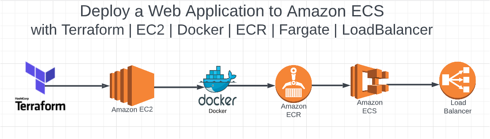

# Deploying a Web Application to Amazon ECS with:

## EC2  | Docker | ECR | Fargate | LoadBalancer

## Flow of Execution:

## Step1:
  - Create EC2 - VPC - Pub and Priv Subnets - IGW - SG - S3 - EBS Volume Using Terraform
  - Install Docker
  - Build Docker Image
## Step2:
  - Creating ECR
  - Login to ECR
  - Tag existing image as AWS ECR repo
  - Push Image into ECR
## Step3:
  - Creating Application Load Balancer
## Step4: 
  - Create Task Definition | Create AWS ECS Cluster | Create Service
## Step4: 
  - Validation
 
 
